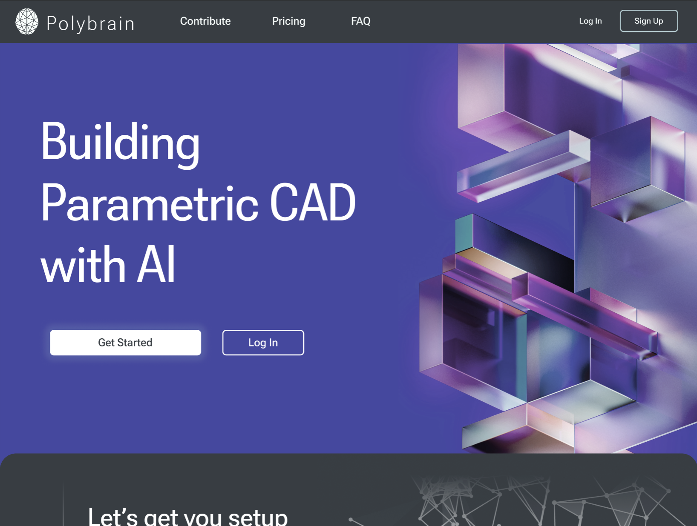

# Polybrain Site

Polybrain is an AI assistant for OnShape. To use Polybrain, users must first setup an
account; that is site. Other miscelanious blogs and legal documents are stored here as
well. This website can be accessed at [polybrain.xyz](https://polybrain.xyz).

## Features

On this site,

- Users can add their OnShape Developer tokens (Access token and Secret token) and their OpenAI token to their Polybrain account.
- Visitors can view supporting documents, make donations, and view legal agreements.

## Installation

This project was created with [create-react-app](<[https://github.com/facebook/create-react-app](https://create-react-app.dev/)>) and is written in TypeScript. To install and run the project locally, follow these steps:

1. Clone this repository.
2. Navigate to the project directory.
3. Run `npm install` to install the dependencies.
4. Run `npm start` to start the development server.

## File Structure

- **public/**: Contains assets for the website.
- **src/**
  - **assets/**: Stores assets for specific pages.
  - **components/**: Defines React components and their supporting CSS.
  - **pages/**: Contains individual pages, each nested in its own subdirectory. For example, the home page can be found at `src/pages/home/home.jsx`.

> As many assets as possible are served with a [bunny.net](https://bunny.net/) CDN; email kyletennison05@gmail.com for information on managing this CDN.

## Contribution

Contributions to this project are welcome. Feel free to submit pull requests and raise issues.

## Documentation

For developers interested in integrating or extending Polybrain beyond the website, you can refer to the [contributing section](https://polybrain.xyz/contribute) on the Polybrain website. Please note that this documentation is more tailored towards the core Polybrain product, not the React site.

## License

This project is licensed under the terms of the MIT license.
